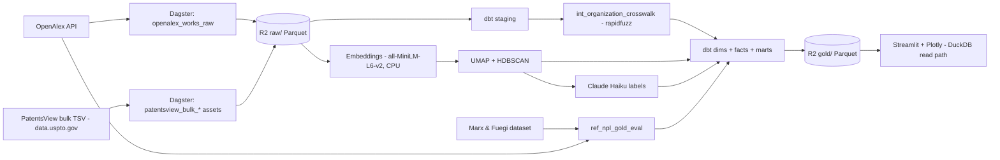

# ARCHITECTURE.md — Paper → Patent

This document explains *why* the system is built the way it is. The build steps live in `ROADMAP.md`; the rules live in `CLAUDE.md`; this is the design rationale, layer by layer, in **used / considered / why** form. The shape is a lakehouse-lite: an object-storage data lake (Parquet on R2) with an embedded engine (DuckDB) for both transformation and serving, an orchestrated Python pipeline around it, and the genuinely hard work concentrated in two places — entity resolution and the paper↔patent linkage.

## Design constraints (the lens every decision passes through)

Every choice below is downstream of five constraints. They are the reason the stack is deliberately lean in some places and deliberately deep in others.

1. **Portfolio-grade volume, not enterprise scale.** The filtered corpus is ~1–2 GB; the data the app serves is single-digit MB. Infrastructure sized for terabytes would be cosplay.
2. **Near-zero cost.** Everything runs on free tiers; the only spend is a few dollars of LLM labelling. No GPU, no managed-warehouse compute cap.
3. **Single maintainer, built in sessions.** Favours reproducibility, tests, and clear lineage over operational machinery that assumes a team.
4. **Spend complexity on the hard problems.** The two sources share no key, and a paper-to-patent lead-time claim is easy to make and easy to get wrong. Sophistication goes into entity resolution and defensible linkage — not into storage topology.
5. **Honesty over impressiveness.** US-only patent coverage, English-only papers, and correlational-vs-causal signals are surfaced, not buried. Owning a limitation reads as more senior than hiding it.

## Data flow

<!-- MAINTAINED: data-flow -->

Raw data lands as Parquet in R2. The PatentsView side uses bulk TSV downloads (no API key; full corpus in one shot). The Marx & Fuegi dataset joined to OpenAlex via the MAG ID crosswalk forms the NPL gold eval set. DuckDB (via dbt) reads R2 in place, the rapidfuzz-built crosswalk unifies organisations, and the ML branch adds technology clusters as a late-arriving attribute. The modelled gold layer is written back to R2 as small Parquet files, which the Streamlit app reads directly with in-process DuckDB. Dagster orchestrates everything and owns the lineage.
<!-- /MAINTAINED -->

## Tech stack

<!-- MAINTAINED: tech-stack -->
| Layer | Tool |
|---|---|
| Language | Python 3.11+, SQL (dbt), HCL (Terraform) |
| Dev & quality | uv, ruff, pyright (strict), pytest, GitHub Actions |
| IaC | Terraform (+ Cloudflare provider) |
| Orchestration | Dagster OSS (+ dagster-dbt) |
| Ingestion | PatentsView bulk TSV (data.uspto.gov), OpenAlex HTTP client, polars |
| Data lake | Cloudflare R2, Parquet |
| Warehouse + transform | DuckDB, dbt-core + dbt-duckdb |
| Entity resolution | rapidfuzz (splink only if eval set demands it) |
| ML / NLP | sentence-transformers (all-MiniLM-L6-v2), umap-learn, hdbscan, scikit-learn |
| LLM | Anthropic Claude Haiku |
| Serving | Streamlit (Community Cloud), Plotly (scattergl), DuckDB read path |
<!-- /MAINTAINED -->

---

## 1. Data sources

**Used.** OpenAlex for global research output; PatentsView bulk TSV files (data.uspto.gov) for US patents. The PatentSearch API (`search.patentsview.org`) is available for supplementary targeted lookups but is not the primary ingestion route. The Marx & Fuegi "Reliance on Science" dataset is used as the NPL linkage gold eval set (not as a data source for the pipeline itself).

**Considered.** For research: Crossref, Semantic Scholar, Lens.org. For patents: PatentSearch API as primary (rejected — pagination caps and rate limits make it wrong for full-corpus pulls), Google Patents Public Data (BigQuery), the EPO Open Patent Services (OPS).

**Why.** OpenAlex is free, open, and global, and ships the three things this project needs: ROR institution IDs (free entity-resolution wins), a topic taxonomy (scope filtering), and abstracts as an inverted index (reconstructable for embeddings). PatentsView is chosen for its *disambiguated assignees*, CPC classifications, and — critically — the `g_other_reference` table of non-patent literature citations (~64 million rows, CC-BY-4.0) that makes the paper→patent bridge possible. The bulk files ship the same disambiguated data as the API without rate limits or pagination complexity; the API is reserved for targeted supplementary calls. The scope is restricted to three science-adjacent microchip sub-families (EUV lithography, silicon photonics, neuromorphic & in-memory compute) — pure logic/CMOS patents are NPL-poor and excluded. This NPL-density decision is validated in the Part 0 spike before any pipeline code is written. Google Patents Public Data would add global coverage but drags in BigQuery and GCP; deferred to v2. PatentsView is US-only; that constraint shapes the entire framing (see Known limitations).

## 2. Ingestion & orchestration

**Used.** Dagster OSS with software-defined assets; one tested Python HTTP client per source; polars for in-memory wrangling.

**Considered.** Plain scripts + a Makefile; cron + GitHub Actions; Airflow; Prefect; a generic EL framework such as dlt.

**Why.** This pipeline is a genuine multi-stage DAG — ingest two sources, resolve entities, model, embed, cluster, build marts — and the lineage is part of the deliverable, not incidental. Dagster's assets map one-to-one onto the data artifacts, give idempotency for free, and produce a lineage graph a reviewer can read. Airflow is task-centric and heavier; plain scripts lose observability and lineage. Self-hosted OSS is chosen over Dagster Cloud to avoid credit limits. A generic EL tool (dlt) was considered but rejected for ingestion because PatentSearch's ~27-endpoint stitching is idiosyncratic enough that a hand-written, fixture-tested client is clearer and more maintainable than bending a generic framework around it.

## 3. Storage & data lake

**Used.** Cloudflare R2 as the object store; Parquet as the only on-disk format in pipelines.

**Considered.** A laptop filesystem; AWS S3 or Google Cloud Storage; a relational database as the landing zone.

**Why.** The app is hosted on Streamlit Community Cloud, so the data has to be reachable from outside a laptop — object storage, not local files. R2's defining feature is zero egress fees, which matters because DuckDB reads from it during both the build and at serve time; S3 and GCS would charge for that traffic. Parquet (columnar, typed, compressed) is used everywhere over CSV, which is debug-only per `CLAUDE.md`. A relational landing zone is unnecessary: DuckDB queries Parquet natively, so the lake *is* the source of truth and the warehouse is just an engine over it.

## 4. Infrastructure as Code

**Used.** Terraform with the Cloudflare provider, managing the R2 bucket and access scope.

**Considered.** OpenTofu; clicking the bucket together in the dashboard (ClickOps); a one-off shell script.

**Why.** IaC is kept for reproducibility and as an explicit, reviewable artifact of the storage footprint. The honest framing — stated in the README — is that the footprint is small (a bucket and tokens), so this demonstrates the *pattern* as much as it solves a provisioning problem; that is a deliberate, disclosed choice, not an accident of scale. Terraform was chosen over OpenTofu by preference; the `.tf` syntax is identical, so the distinction is cosmetic here. State and any secret-bearing `*.tfvars` are gitignored.

## 5. Warehouse & transformation

**Used.** DuckDB as an embedded analytical engine, with dbt-core + dbt-duckdb for the SQL layer. Models build locally against the R2 Parquet into a local `dev.duckdb` file; the `gold_export` Dagster asset then reads from `dev.duckdb` and writes versioned Parquet snapshots to `r2://p2p-lake/gold/` using the stage-then-promote COPY pattern; the app queries those gold files with in-process DuckDB.

**Considered.** MotherDuck (managed DuckDB); Snowflake or BigQuery; transforming purely in Python (polars) with no dbt.

**Why.** At ~1–2 GB, DuckDB handles the entire corpus on a laptop, and the served gold layer is single-digit MB — so a managed warehouse would add a service, a credential, and a usage cap for no real benefit. "Ran 2 GB on DuckDB and didn't reach for a managed warehouse" is itself the senior judgment; the tool count is not the signal. dbt is used over ad-hoc Python transforms because the entity-resolution joins *must* be tested — `relationships`, `unique`, `not_null` assertions are the guard against the silent corruption a bad merge would cause — and because staging → intermediate → marts layering keeps the modelling auditable and re-runnable. MotherDuck remains a clean v2 migration path if a future version's volume ever outgrows DuckDB.

## 6. Entity resolution

<!-- MAINTAINED: entity-resolution -->
**Used.** A layered resolver producing one `org_id` per real-world organisation across both sources, every row tagged with `match_method` and `confidence`:
1. **Within-source disambiguation** — OpenAlex institution ID / ROR as the paper-side identity; PatentsView `assignee_id` as the patent-side identity (`native_id` / `ror`). Note: ROR and `assignee_id` each disambiguate *within* their own source — neither bridges the two sources on its own.
2. **Seed crosswalk (PatentsView side)** — a small hand-maintained map for the unambiguous heavyweights in scope (NVIDIA, TSMC, ASML, Stanford, IMEC, …), `match_method = seed_crosswalk`. Covers the head of the distribution before fuzzy matching.
2a. **Seed crosswalk (OpenAlex side)** — for orgs whose PV legal name and OA display name are too different for the fuzzy bridge (e.g. "The Board of Trustees of the Leland Stanford Junior University" vs "Stanford University"), the seed CSV carries the OpenAlex `institution_id` explicitly. Joined on that ID, not on name.
3. **Fuzzy bridge** — first-token blocking + `rapidfuzz` token-set ratio. **Only score = 100 is accepted** (`fuzzy_high`). `token_set_ratio = 100` means one name's token set is a strict subset of the other's — the only safe matching criterion. Scores 90–99 were empirically found to be false positives (e.g. "University of Southampton" ↔ "University of Roehampton" scored 89.8, "National Institute of Standards and Technology" ↔ "National Eye Institute" scored 90.1). The `fuzzy_review` band is not used.

Quality is measured against a hand-labelled eval set (`docs/er_eval_set.md`). Verified 2026-06-22: all 10 Tier-3 non-match pairs correctly excluded; all 1,160 accepted rows at exactly score=100; precision = 1.00.

**Considered.** Exact match after normalisation only; `splink` as the primary fuzzy engine; embedding-based name similarity; a commercial entity-resolution API; a purely manual crosswalk; a `fuzzy_review` band with manual resolution.

**Why.** The two sources share no key and the cross-source bridge is the project's hard problem. `token_set_ratio = 100` (exact/subset) is stricter than threshold-tuning: it eliminates the entire class of false positives from shared structural tokens ("University of X" vs "University of Y") without requiring manual review of hundreds of borderline pairs. The seed crosswalk handles the head of the distribution (the 40 orgs that matter most); the fuzzy bridge at 100 captures same-name long-tail corporate entities. Precision is favoured over recall because a single false merge poisons every downstream competitive-intelligence number. Person-level matching is **out of scope for v1**.
<!-- /MAINTAINED -->

## 7. Paper ↔ patent linkage

**Used.** Non-patent-literature citations from `g_other_reference` (PatentsView bulk), matched to OpenAlex works by DOI regex (`confidence = high`) or fuzzy title (`confidence = medium`), stored as `fact_npl_link`. The interval between a paper's `publication_date` and the citing patent's `filing_date` is the **citation lag** — a precisely defined, defensible measure. It is never described as "lead time" or "R&D-to-market time", which imply causation the data does not support. Organisation-level co-occurrence (the same `org_id` both publishes and patents in a cluster) is a *separate*, clearly-labelled soft signal (`org_cooccurrence`) and is never written into the NPL-link table.

**Linkage quality** is measured against the **Marx & Fuegi gold eval set**: their matched patent→paper pairs (from the "Reliance on Science" dataset, covering USPTO patents through ~2021) joined to OpenAlex via the MAG ID crosswalk (`ids.mag`), filtered to scope patents. Precision and recall of our own matcher vs that benchmark are recorded in `docs/data_source_manifest.md`. Because our matcher uses OpenAlex (the successor to MAG), it extends coverage to 2025 — matched pairs for patents citing 2021+ papers exist in our data but not in the Marx/Fuegi baseline.

**Considered.** Keyword co-occurrence over time as the primary linkage; topic-model overlap; no linkage at all; using the Marx/Fuegi matched pairs directly as the pipeline output (rejected — the DE value is building and measuring our own matcher, not inheriting someone else's).

**Why.** An NPL citation is an actual directed link from a patent to the literature it builds on — not a correlation. This is the analytical core of the project. The integrity rule from `CLAUDE.md` is enforced structurally: a correlation is never written into a column that implies causation, and the UI always shows which kind of signal a number rests on. Using a published academic dataset as the quality benchmark makes the precision/recall claim citable and independently verifiable.

## 8. Semantic clustering & labelling

**Used.** `all-MiniLM-L6-v2` (384-dim) embeddings computed on CPU → UMAP to 2D → HDBSCAN clustering → c-TF-IDF top terms per cluster → Claude Haiku writes a human-readable family name (`tagline`) and a plain-English description (`summary_friendly`). BERTopic is an acceptable wrapper for exactly this stack.

**Considered.** K-Means; LDA / classical topic models; larger embedding models (e5, GTE) on a GPU; raw cluster IDs with no labels; a CPC-only manual taxonomy.

**Why.** K-Means forces spherical, equal-ish clusters, needs a preset *k*, and produces no labels — wrong for organic, uneven technology families. UMAP + HDBSCAN finds variable-density clusters and gives a principled noise bucket (surfaced honestly in the UI as a "frontier / unclustered" zone); c-TF-IDF extracts the defining terms; Haiku turns those terms into names a non-expert can read — the readability requirement is that a person sees "EUV lithography", never "cluster 23". `all-MiniLM-L6-v2` is small enough to run on CPU in minutes; a larger model would force a GPU (and Modal) for marginal quality gain at this scale, which the constraints rule out. CPC codes alone are a rigid human taxonomy that misses cross-cutting and emerging families, so clustering complements rather than replaces them.

**Production run (2026-06-26).** 197,456 docs → 303 named clusters + `c_noise`. Spot-check: 14/15 labels rated accurate (93.3%). Noise rate: **42.1% (83,182 docs)**. This is higher than ideal and has two likely causes: (1) UMAP fell back to random initialisation (spectral eigenvector solver failed on the eigengap), producing a more diffuse 2D layout; (2) the corpus spans three broad technology families whose boundary documents (e.g. a paper combining silicon photonics and neuromorphic computing) sit in low-density interstitial space and get no cluster assignment. The 303 named clusters are high-quality precisely because HDBSCAN was strict. **Decision:** treat `c_noise` as a named zone ("Frontier / Unclustered") in the UI rather than re-tuning — the named clusters serve all Part 6 analytics, and the noise documents still have UMAP coordinates and appear in the scatter map. Potential re-tune (lower `min_cluster_size` to 30, or fix UMAP init to `pca`) is noted for Part 7 if the map feels too sparse.

## 9. Serving & presentation

**Used.** Streamlit on Community Cloud with Plotly `scattergl` for the technology map. The app reads the small gold Parquet from R2 with in-process DuckDB (`httpfs` + a **read-only** R2 token), cached with `st.cache_data` / `st.cache_resource`.

**Considered.** A FastAPI backend with a JavaScript frontend; Evidence.dev or Observable Framework; Plotly Dash; a static notebook; querying a MotherDuck-hosted warehouse from the app.

**Why.** The served data is small and read-only, so the app queries gold Parquet directly — the fewest hops, the smoothest demo, and no second service or API cold-start to manage. Streamlit is the fastest path to a hosted public demo a recruiter can open in one click. Plotly `scattergl` (WebGL) is required to render tens of thousands of points smoothly. A FastAPI tier is noted as a v2 hardening option, not a v1 need; Evidence.dev is a reasonable future alternative for a more BI-as-code feel. The read-only R2 token enforces least privilege: the public app can never reach the read-write build credentials.

---

## Data model

<!-- MAINTAINED: schema -->
A star schema in the marts layer. Conformed dimensions are shared across the fact tables; `org_id` (from the crosswalk) is the spine that lets patents and papers be analysed together.

**Dimensions**
- `dim_organization` — one row per resolved organisation (`org_id`); carries the source IDs it unifies plus `match_method` / `confidence`.
- `dim_paper` — one row per OpenAlex work; publication date, venue, institutions.
- `dim_patent` — one row per US patent; **filing date** (the velocity anchor), grant date (metadata only), assignee, CPC.
- `dim_cpc` — CPC subclass reference for human-readable classification.
- `dim_technology_cluster` — one row per cluster; `tagline`, `summary_friendly`, `top_terms` (populated in Part 5).

**Facts**
- `fact_publication` — grain: paper. Measures + foreign keys to org, cluster, time.
- `fact_patent_filing` — grain: patent filing. Filing-date anchored; FKs to org, CPC, cluster, time.
- `fact_patent_citation` — grain: patent→patent citation edge.
- `fact_npl_link` — grain: patent→paper edge from NPL citations; carries `match_method` (`npl_citation`) and `confidence`.
- `fact_document_cluster` — grain: document; `cluster_id`, `umap_x`, `umap_y`, `model_version`.

**Intermediate**
- `int_organization_crosswalk` — the rapidfuzz-built `org_id` mapping (see §6).
- `ref_npl_gold_eval` — Marx & Fuegi `_pcs_oa.csv` filtered to scope patents. The `oaid` column is already an OpenAlex work ID — no MAG bridge required. Reference table used for NPL matcher quality measurement; never enters a mart.

**Gold marts (what the app reads)**
- `mart_velocity` — per cluster: research-onset vs patent-onset series + median **citation lag** (paper `publication_date` → citing patent `filing_date`), computed the NPL-linked way and (separately, labelled) the soft cohort way.
- `mart_competitive` — per cluster: assignees capturing IP vs institutions producing research, with counts and shares.
- `mart_gap` — per cluster: assignee concentration of US patenting (Herfindahl-Hirschman Index over `assignee_id`) vs breadth of global research output (institution count + country diversity from OpenAlex). The story is "researched broadly, patented narrowly" measured as concentration within US patents — not a geography comparison, which would be circular given US-only patent coverage.

**Canonical query** — `models/queries/idea_journey.sql` returns, for an `org_id` or topic, its papers, its patents, and the NPL links between them; it is the integration check used throughout the build.
<!-- /MAINTAINED -->

## Cross-cutting concerns

**Provenance & confidence.** Every organisation match and every paper↔patent edge carries `match_method` and `confidence`. The UI renders confidence so a reader always knows whether a number rests on a hard NPL link or a soft co-occurrence. This is the project's integrity backbone, not a nicety.

**Dates & time semantics.** The citation-lag metric uses patent **filing date** (or priority date where available) and paper **publication date**. Grant date is never used for any time metric because it carries years of administrative lag; it appears only as metadata. Filtering the corpus is also done on filing date, so the corpus is not silently biased toward older inventions.

**Secrets & security.** No secrets in code — env vars and a gitignored `.env.local` only. The build machine holds read-write R2 credentials; the public app holds a separate read-only R2 token. Terraform state and secret-bearing tfvars are gitignored.

**Testing & CI.** Every Dagster asset has a fixture-based correctness test that checks values, not just that it runs. dbt enforces `unique` / `not_null` / `relationships` on the joins. Entity resolution and lead-time logic are tested on hand-labelled fixtures. GitHub Actions runs ruff + pyright (strict) + pytest on every PR; all must pass before merge.

**Cost.** Free tiers throughout (R2, GitHub, Streamlit Community Cloud, OpenAlex, PatentsView), DuckDB is a free library, and there is no GPU spend. The only out-of-pocket cost is a few dollars of Anthropic API for cluster labelling, protected by a spend cap.

## What we deliberately did not build (and why)

- **A managed warehouse (MotherDuck / Snowflake / BigQuery).** DuckDB over R2 covers ~1–2 GB; a service + credential + compute cap buys nothing here.
- **GPU compute / Modal.** The embedding model is small and runs on CPU; a GPU would be idle capacity.
- **A vector database (Qdrant).** The product is clustering, not similarity search. UMAP coordinates live in the warehouse; in-warehouse cosine covers any future "related work" need.
- **A cloud hyperscaler (AWS / GCP / Azure).** R2 + DuckDB are cheaper and simpler at this volume; GCP becomes relevant only if v2 adds global patent coverage via Google Patents Public Data.
- **A FastAPI / JS frontend tier.** Read-only, small data → the app queries gold Parquet directly. A v2 hardening option, not a v1 requirement.
- **Keyword-only patent filtering.** Scope is defined by CPC/IPC classification codes (with topics on the OpenAlex side), which are far more precise than keyword matching.
- **Person-level talent-flow matching.** High value but a separate hard disambiguation problem; deferred to v2.

## Known limitations

These are disclosed in the UI and README, not hidden:

- **US-only patents.** PatentsView is US filings; for semiconductors especially, much of the world's patenting happens elsewhere. The honest framing is "global research vs *US* commercialisation"; the global fix is a v2 item.
- **English-only papers.** The corpus filters to English abstracts, biasing the research side toward anglophone output.
- **Entity-resolution long tail.** The head of the organisation distribution is well resolved; the tail (subsidiaries, JVs, small entities) is necessarily fuzzier, and the chosen rules are documented rather than presented as solved.
- **Citation lag ≠ R&D-to-market time.** The paper-publication-to-patent-filing interval is a citation lag, not a commercialisation timeline. Examiner-added citations can reference prior art being distinguished, not built upon. The metric is precisely defined and disclosed; "lead time" language is never used.
- **NPL citation coverage and quality.** Patent "other reference" text is inconsistent free-text; DOI matches are high-confidence, fuzzy title matches are medium, and unmatchable references are dropped — so the linkage is a high-precision sample, not exhaustive.
- **Point-in-time snapshot.** v1 is a clean full build, not a live feed; an incremental/scheduled refresh is a v2 extension.

## Where this goes next

The ranked v2 backlog lives in `ROADMAP.md` → *Beyond v1*. The highest-value threads are person-level talent flow (researchers moving into corporate IP) and global patent coverage (which turns the US-only caveat into a genuinely global research-vs-commercialisation map).
