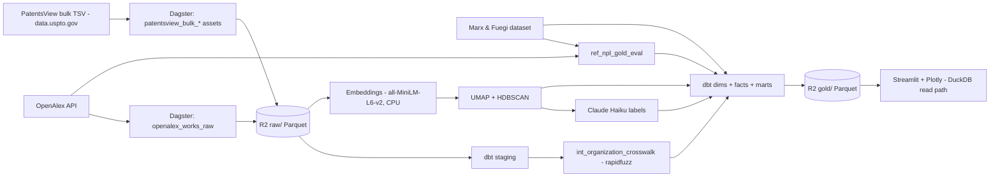

# ARCHITECTURE.md — Paper → Patent

This document explains *why* the system is built the way it is. The build steps live in `ROADMAP.md`; the rules live in `CLAUDE.md`; this is the design rationale, layer by layer, in **used / considered / why** form. The shape is a lakehouse-lite: an object-storage data lake (Parquet on R2) with an embedded engine (DuckDB) for both transformation and serving, an orchestrated Python pipeline around it, and the genuinely hard work concentrated in two places — entity resolution and the paper↔patent linkage.

## Design constraints (the lens every decision passes through)

Every choice below is downstream of five constraints. They are the reason the stack is deliberately lean in some places and deliberately deep in others.

1. **Portfolio-grade volume, not enterprise scale.** The filtered corpus is ~1–2 GB; the data the app serves is single-digit MB. Infrastructure sized for terabytes would be cosplay.
2. **Near-zero cost.** Everything runs on free tiers; the only spend is a few dollars of LLM labelling. No GPU, no managed-warehouse compute cap.
3. **Single maintainer, built in sessions.** Favours reproducibility, tests, and clear lineage over operational machinery that assumes a team.
4. **Spend complexity on the hard problems.** The two sources share no key, and a paper-to-patent lead-time claim is easy to make and easy to get wrong. Sophistication goes into entity resolution and defensible linkage — not into storage topology.
5. **Honesty over impressiveness.** US-only patent coverage, English-only papers, and correlational-vs-causal signals are surfaced, not buried. Owning a limitation reads as more senior than hiding it.

## Data flow

<!-- MAINTAINED: data-flow -->

Raw data lands as Parquet in R2. The PatentsView side uses bulk TSV downloads (no API key; full corpus in one shot). The Marx & Fuegi dataset joins to OpenAlex directly on its own numeric work ID (no MAG-ID bridge needed) and serves two roles: it forms the NPL gold eval set, and — for any patent it covers at all — it is the primary source of `fact_npl_link` edges, with our own DOI + fuzzy-title matcher filling only the patents outside its coverage (see §7). DuckDB (via dbt) reads R2 in place, the rapidfuzz-built crosswalk unifies organisations, and the ML branch adds technology clusters as a late-arriving attribute. The modelled gold layer is written back to R2 as small Parquet files, which the Streamlit app reads directly with in-process DuckDB. Dagster orchestrates everything and owns the lineage.
<!-- /MAINTAINED -->

## Tech stack

<!-- MAINTAINED: tech-stack -->
| Layer | Tool |
|---|---|
| Language | Python 3.11+, SQL (dbt), HCL (Terraform) |
| Dev & quality | uv, ruff, pyright (strict), pytest, GitHub Actions |
| IaC | Terraform (+ Cloudflare provider) |
| Orchestration | Dagster OSS (+ dagster-dbt) |
| Ingestion | PatentsView bulk TSV (data.uspto.gov), OpenAlex HTTP client, polars |
| Data lake | Cloudflare R2, Parquet |
| Warehouse + transform | DuckDB, dbt-core + dbt-duckdb |
| Entity resolution | rapidfuzz (splink only if eval set demands it) |
| ML / NLP | sentence-transformers (all-MiniLM-L6-v2), umap-learn, hdbscan, scikit-learn, langdetect (embedding quality gate) |
| LLM | Anthropic Claude Haiku |
| Serving | Streamlit (Community Cloud), Plotly (scattergl), DuckDB read path, streamlit-searchbox (ILIKE org search) |
<!-- /MAINTAINED -->

---

## 1. Data sources

**Used.** OpenAlex for global research output; PatentsView bulk TSV files (data.uspto.gov) for US patents. The PatentSearch API (`search.patentsview.org`) is available for supplementary targeted lookups but is not the primary ingestion route. The Marx & Fuegi "Reliance on Science" dataset is used as the NPL linkage gold eval set (not as a data source for the pipeline itself).

**Considered.** For research: Crossref, Semantic Scholar, Lens.org. For patents: PatentSearch API as primary (rejected — pagination caps and rate limits make it wrong for full-corpus pulls), Google Patents Public Data (BigQuery), the EPO Open Patent Services (OPS).

**Why.** OpenAlex is free, open, and global, and ships the three things this project needs: ROR institution IDs (free entity-resolution wins), a topic taxonomy (scope filtering), and abstracts as an inverted index (reconstructable for embeddings). PatentsView is chosen for its *disambiguated assignees*, CPC classifications, and — critically — the `g_other_reference` table of non-patent literature citations (~64 million rows, CC-BY-4.0) that makes the paper→patent bridge possible. The bulk files ship the same disambiguated data as the API without rate limits or pagination complexity; the API is reserved for targeted supplementary calls. The scope is restricted to three science-adjacent microchip sub-families (EUV lithography, silicon photonics, neuromorphic & in-memory compute) — pure logic/CMOS patents are NPL-poor and excluded. This NPL-density decision is validated in the Part 0 spike before any pipeline code is written. Google Patents Public Data would add global coverage but drags in BigQuery and GCP; deferred to v2. PatentsView is US-only; that constraint shapes the entire framing (see Known limitations).

## 2. Ingestion & orchestration

**Used.** Dagster OSS with software-defined assets; one tested Python HTTP client per source; polars for in-memory wrangling.

**Considered.** Plain scripts + a Makefile; cron + GitHub Actions; Airflow; Prefect; a generic EL framework such as dlt.

**Why.** This pipeline is a genuine multi-stage DAG — ingest two sources, resolve entities, model, embed, cluster, build marts — and the lineage is part of the deliverable, not incidental. Dagster's assets map one-to-one onto the data artifacts, give idempotency for free, and produce a lineage graph a reviewer can read. Airflow is task-centric and heavier; plain scripts lose observability and lineage. Self-hosted OSS is chosen over Dagster Cloud to avoid credit limits. A generic EL tool (dlt) was considered but rejected for ingestion because PatentSearch's ~27-endpoint stitching is idiosyncratic enough that a hand-written, fixture-tested client is clearer and more maintainable than bending a generic framework around it.

## 3. Storage & data lake

**Used.** Cloudflare R2 as the object store; Parquet as the only on-disk format in pipelines.

**Considered.** A laptop filesystem; AWS S3 or Google Cloud Storage; a relational database as the landing zone.

**Why.** The pipeline and the served warehouse both have to reach the data from outside a laptop — object storage, not local files. R2's defining feature is zero egress fees, which matters because the build reads raw Parquet from it heavily: both the local DuckDB build and MotherDuck's `--target prod` build pull the raw corpus from R2 via `httpfs`; S3 and GCS would charge for that traffic. (The app no longer reads R2 directly — it reads MotherDuck; see §5 and §9.) Parquet (columnar, typed, compressed) is used everywhere over CSV, which is debug-only per `CLAUDE.md`. A relational landing zone is unnecessary: DuckDB queries Parquet natively, so the lake *is* the source of truth and the warehouse is just an engine over it.

## 4. Infrastructure as Code

**Used.** Terraform with the Cloudflare provider, managing the R2 bucket and access scope.

**Considered.** OpenTofu; clicking the bucket together in the dashboard (ClickOps); a one-off shell script.

**Why.** IaC is kept for reproducibility and as an explicit, reviewable artifact of the storage footprint. The honest framing — stated in the README — is that the footprint is small (a bucket and tokens), so this demonstrates the *pattern* as much as it solves a provisioning problem; that is a deliberate, disclosed choice, not an accident of scale. Terraform was chosen over OpenTofu by preference; the `.tf` syntax is identical, so the distinction is cosmetic here. State and any secret-bearing `*.tfvars` are gitignored.

## 5. Warehouse & transformation

**Used.** DuckDB as the engine, with dbt-core + dbt-duckdb for the SQL layer, materialising into **MotherDuck** (managed DuckDB) as the served warehouse. The Dagster pipeline runs `dbt build --target prod`, which reads the raw Parquet from R2 via `httpfs` and builds staging → intermediate → marts directly into MotherDuck (`md:paper_to_patent`); the ML assets (embeddings, clustering, labels, NPL matcher) read their corpus from that same warehouse via the shared `resources/warehouse.py` helper. A local `dev.duckdb` (`--target dev`) is kept for fast offline iteration. The app queries MotherDuck with in-process DuckDB (`md:`), falling back to the local file when `MOTHERDUCK_TOKEN` is unset.

**Considered.** Keeping the prior design — dbt into local `dev.duckdb`, then a `gold_export` asset writing versioned Parquet snapshots to `r2://p2p-lake/gold/`, read by the app over `httpfs`; Snowflake or BigQuery; transforming purely in Python (polars) with no dbt.

**Why.** The app is hosted on Streamlit Community Cloud — a container that cannot reach a laptop's local `dev.duckdb`, so the served marts must live somewhere reachable. The prior design solved that by exporting a versioned gold Parquet layer to R2; the pivot to MotherDuck **collapses that export step**: the app reads exactly what dbt last built, so there is one served source of truth and no `R2_SNAPSHOT_DATE` to coordinate (the class of staleness the `gold_export` asset was prone to, since nothing tied it to dbt completion). MotherDuck is managed DuckDB — same engine, same SQL dialect, same dbt-duckdb adapter (`md:` path) — so the migration cost was low. dbt is used over ad-hoc Python transforms because the entity-resolution joins *must* be tested — `relationships`, `unique`, `not_null` assertions guard against the silent corruption a bad merge would cause. Snowflake/BigQuery stay rejected as overkill at ~1–2 GB. **Trade-offs accepted:** the immutable versioned-snapshot property of the R2 gold layer is given up (a MotherDuck table is overwritten each build — see Known Limitations), and the served path now depends on MotherDuck's free-tier availability and usage caps.

**Acyclic orchestration — the dbt build split around the ML boundary (2026-07-11).** The ML assets read dbt's dims and dbt's marts read the ML clusters, which once forced a cycle resolved only by an "empty relation until ML runs once" bootstrap and two manual dbt passes. It is now a single acyclic graph. Two feedback edges were cut: (1) the corpus-exclusion gate is its own upstream asset — `document_exclusions` reads the **raw** corpus and writes `excluded_documents` *before* staging applies it (the gate needs only title/abstract text, not embeddings), so staging→exclusions is an ordinary forward dependency; (2) `dim_paper`/`dim_patent` no longer denormalise `cluster_id` — the bridge `fact_document_cluster` is the sole doc→cluster source, so the dims stop depending on the clustering that reads them. The single `dbt build` is therefore split into two Dagster `@dbt_assets` — `paper_to_patent_dbt_pre` (staging + dims + non-cluster facts) and `paper_to_patent_dbt_post` (cluster fact + NPL fact + marts) — partitioned by the dbt source graph, with a `DagsterDbtTranslator` mapping the five mid-pipeline sources (`clusters`, `cluster_labels`, `excluded_documents`, `npl_links`, `mf_npl_links`) to the Python assets that produce them. A single `materialize all` runs ingest → exclusions → dbt_pre → matchers/ML → dbt_post in topological order (`dagster definitions validate` passes with the honest deps that previously would have formed a cycle). `create_external_sources()` remains as the R2→dbt-source view bridge; its empty-relation default is now only a defensive net for a standalone `dbt build`. See `docs/workflow.md` Stages 4a/4/9.

## 6. Entity resolution

<!-- MAINTAINED: entity-resolution -->
**Used.** A layered resolver producing one `org_id` per real-world organisation across both sources, every row tagged with `match_method` and `confidence`:
1. **Within-source disambiguation** — OpenAlex institution ID / ROR as the paper-side identity; PatentsView `assignee_id` as the patent-side identity (`native_id` / `ror`). Note: ROR and `assignee_id` each disambiguate *within* their own source — neither bridges the two sources on its own.
2. **Seed crosswalk (PatentsView side)** — a small hand-maintained map for the unambiguous heavyweights in scope (NVIDIA, TSMC, ASML, Stanford, IMEC, …), `match_method = seed_crosswalk`. Covers the head of the distribution before fuzzy matching.
2a. **Seed crosswalk (OpenAlex side)** — for orgs whose PV legal name and OA display name are too different for the fuzzy bridge (e.g. "The Board of Trustees of the Leland Stanford Junior University" vs "Stanford University"), the seed CSV carries the OpenAlex `institution_id` explicitly. Joined on that ID, not on name.
2b. **ROR bridge** (`ror_bridge` asset) — for seeded PV orgs that still have no OpenAlex entry after layers 1–2a (2,521 orgs including IBM, Samsung Display, Micron, Carl Zeiss, SK Hynix). Queries the OpenAlex Institutions API by canonical name. Accepts an institution if every normalized token in the canonical name appears in the result's display name (`canonical_tokens ⊆ result_tokens`). More-specific orgs (Samsung Display, 2 tokens) are processed before less-specific parents (Samsung, 1 token) to prevent parent absorption. `match_method = ror_bridge`, `confidence = high`. Root cause this layer closes: first-token blocking in the fuzzy bridge prevents acronym/full-name pairs from ever being compared (e.g. "International Business Machines Corporation" → block "international"; "IBM Research - Almaden" → block "ibm").
3. **Fuzzy bridge** — first-token blocking + `rapidfuzz` token-set ratio. **Only score = 100 is accepted** (`fuzzy_high`). `token_set_ratio = 100` means one name's token set is a strict subset of the other's — the only safe matching criterion. Scores 90–99 were empirically found to be false positives (e.g. "University of Southampton" ↔ "University of Roehampton" scored 89.8, "National Institute of Standards and Technology" ↔ "National Eye Institute" scored 90.1). The `fuzzy_review` band is not used.

Quality is measured against a hand-labelled eval set (`docs/er_eval_set.md`). Verified 2026-06-22 (score=100 rule): all 10 Tier-3 non-match pairs correctly excluded; precision = 1.00. Crosswalk size as of 2026-07-04 (post ROR-bridge, post a fix to a source-view bug that had briefly double-counted an earlier snapshot): 16,215 rows / 14,179 distinct `org_id`s (native_id 2,559 · ror 11,743 · fuzzy_high 1,818 · seed_crosswalk 57 · ror_bridge 38).

**Considered.** Exact match after normalisation only; `splink` as the primary fuzzy engine; embedding-based name similarity; a commercial entity-resolution API; a purely manual crosswalk; a `fuzzy_review` band with manual resolution.

**Why.** The two sources share no key and the cross-source bridge is the project's hard problem. `token_set_ratio = 100` (exact/subset) is stricter than threshold-tuning: it eliminates the entire class of false positives from shared structural tokens ("University of X" vs "University of Y") without requiring manual review of hundreds of borderline pairs. The seed crosswalk handles the head of the distribution (the 40 orgs that matter most); the ROR bridge closes the acronym/full-name gap that first-token blocking misses; the fuzzy bridge at 100 captures same-name long-tail corporate entities. Precision is favoured over recall because a single false merge poisons every downstream competitive-intelligence number. Person-level matching is **out of scope for v1**.
<!-- /MAINTAINED -->

## 7. Paper ↔ patent linkage

**Used.** A hybrid source, partitioned per patent. Non-patent-literature citations from `g_other_reference` (PatentsView bulk) are resolved to OpenAlex works two ways: (1) the **Marx & Fuegi "Reliance on Science" dataset** (CC-BY-4.0, Zenodo 7996195) supplies edges directly for any patent it covers at all — its vintage caps out around patents granted ~early 2023; (2) our own matcher — DOI regex (`confidence = high`) or fuzzy title (`confidence = medium`) — fills only the patents M&F has zero coverage of. A `link_source` column (`marx_fuegi` | `doi` | `fuzzy_title`) records which; a patent never draws edges from both (`assert_fact_npl_link_single_source.sql` guards this). Stored as `fact_npl_link`. The interval between a paper's `publication_date` and the citing patent's `filing_date` is the **citation lag** — a precisely defined, defensible measure. It is never described as "lead time" or "R&D-to-market time", which imply causation the data does not support. Organisation-level co-occurrence (the same `org_id` both publishes and patents in a cluster) is a *separate*, clearly-labelled soft signal (`org_cooccurrence`) and is never written into the NPL-link table.

**The seam is per-patent presence, not a date cutoff.** M&F's exact coverage ceiling isn't a clean boundary (it's a mix of grant timing and dataset-refresh timing), so rather than guess a cutoff date, `fact_npl_link.sql` checks per patent: does M&F have *any* row for it? If yes, M&F supplies every edge for that patent — including the rare case where a pre-2023 patent M&F happened to miss falls correctly to the matcher instead. This also means a matcher-found edge on an M&F-covered patent is discarded if M&F itself doesn't have it; since M&F has higher recall than the matcher on its own covered era, a matcher-only edge there is more likely a false positive than a genuine miss the matcher caught that M&F didn't — trust-first, consistent with the project's provenance rule.

**Linkage quality.** The matcher's precision/recall is measured against the **Marx & Fuegi gold eval set** (`ref_npl_gold_eval`): their matched patent→paper pairs joined to OpenAlex directly on `oaid` (already an OpenAlex numeric work ID — no MAG-ID bridge needed), filtered to scope patents. Recorded in `docs/data_source_manifest.md`. This measurement is now explicitly scoped to the matcher's own territory (patents M&F doesn't cover) — it can no longer be read as "how good is fact_npl_link overall," since the M&F-sourced majority of edges carries the published dataset's own accuracy, not our matcher's.

**Considered.** Keyword co-occurrence over time as the primary linkage; topic-model overlap; no linkage at all; using the Marx/Fuegi matched pairs directly as the pipeline output — **originally rejected** (2026-06): "the DE value is building and measuring our own matcher, not inheriting someone else's." **Reversed 2026-07-10** after a measured, offline comparison (join the raw M&F CSV against our own scope + corpus, count overlap) showed M&F dominates the matcher on both coverage and quality for the ~71% of scope patents its vintage covers: 7,125 M&F edges vs 4,619 matcher edges in that overlap, of which only 2,292 agreed — meaning a large fraction of the matcher's edges there were either M&F misses or matcher false positives, and M&F's own published precision beats the matcher's self-graded ~0.85. The remaining ~29% of scope patents (all grants after M&F's vintage ceiling, a share that grows every year) have zero M&F coverage and are the matcher's real job now. The DE value didn't disappear — it moved from "replicate a solved problem everywhere" to "know precisely where a gold dataset's coverage ends and build only for that remainder," which is a smaller, more honest, and arguably harder-to-get-right problem than the one originally scoped.

**Why.** An NPL citation is an actual directed link from a patent to the literature it builds on — not a correlation. This is the analytical core of the project. The integrity rule from `CLAUDE.md` is enforced structurally: a correlation is never written into a column that implies causation, and the UI always shows which kind of signal a number rests on. A published, peer-reviewed dataset is a stronger provenance basis than a self-graded matcher wherever it's available; using it as the quality benchmark for the matcher's remaining territory keeps that precision/recall claim citable and independently verifiable.

## 8. Semantic clustering & labelling

**Used.** `all-MiniLM-L6-v2` (384-dim) embeddings computed on CPU → UMAP to 2D → HDBSCAN clustering → c-TF-IDF top terms per cluster → Claude Haiku writes a human-readable family name (`tagline`) and a plain-English description (`summary_friendly`). BERTopic is an acceptable wrapper for exactly this stack. Before embedding, a quality gate (`resolve_paper_text` in `embeddings.py`) falls a paper back to its title, or excludes it entirely, when its abstract can't be trusted as real content — see "Embedding input quality gate" below.

**Considered.** K-Means; LDA / classical topic models; larger embedding models (e5, GTE) on a GPU; raw cluster IDs with no labels; a CPC-only manual taxonomy.

**Why.** K-Means forces spherical, equal-ish clusters, needs a preset *k*, and produces no labels — wrong for organic, uneven technology families. UMAP + HDBSCAN finds variable-density clusters and gives a principled noise bucket (surfaced honestly in the UI as a "frontier / unclustered" zone); c-TF-IDF extracts the defining terms; Haiku turns those terms into names a non-expert can read — the readability requirement is that a person sees "EUV lithography", never "cluster 23". `all-MiniLM-L6-v2` is small enough to run on CPU in minutes; a larger model would force a GPU (and Modal) for marginal quality gain at this scale, which the constraints rule out. CPC codes alone are a rigid human taxonomy that misses cross-cutting and emerging families, so clustering complements rather than replaces them.

**Embedding input quality gate (added 2026-07-04).** Measuring cluster-family purity against each document's own CPC/topic tag surfaced several artifact clusters formed from non-content text rather than genuine cross-topic overlap: a cluster of papers whose abstract was the literal placeholder string "Abstract not provided.", a cluster of French/Italian/Catalan PhD thesis abstracts all mistagged `language: en` by OpenAlex, and a cluster mixing conference-abstract placeholders, journal editorials, and mistagged bioinformatics-software release notes. `resolve_paper_text()` now runs four checks in order per paper (version-style title → exclude; placeholder or <50-char abstract → fall back to title; non-English abstract via `langdetect` → fall back to title if the title itself is English, else exclude; otherwise use the abstract) and applies the version-style-title check to patents too. All three source clusters are confirmed gone from the next run with no similar artifact taking their place.

**Production run (2026-07-04, post quality-gate).** 186,930 docs → 237 named clusters + `c_noise` (186,933 as originally run; 3 software-release-note titles later removed by a staging-layer fix, see Issue 3 in `MEMORY.md` — `fact_document_cluster` now drops any doc no longer present in the scoped staging models rather than surfacing it as an orphan). Noise rate: **35.4% (66,163 docs)**, down from 42.6% in the pre-gate run — the excluded/fallback text had been diffusing the embedding space generally, not just forming its own clusters. Mean cluster purity against each document's own family tag: 94.2% (median 98.9%); the worst cluster is 44.6%, and inspection shows the remaining low-purity clusters are genuine technical overlap (e.g. resist chemistry shared between EUV and memory-device fabrication), not artifacts. **Decision (unchanged):** `c_noise` remains a named zone ("Frontier / Unclustered") in the UI rather than a target for further re-tuning — noise documents retain UMAP coordinates and appear in the scatter map.

**Documents excluded entirely vs. `c_noise` (found 2026-07-05).** A paper the gate excludes entirely (version-style title, or title+abstract both non-English) is a *different* state from `c_noise`: it never reaches embedding at all, so `fact_document_cluster` has no row for it (not even `c_noise`) — yet it was still sitting in `dim_paper`/`fact_publication`, counting toward `mart_family` totals while being invisible on the map. Verified live: 128 papers in this state, 119 genuinely non-English (mostly French thesis abstracts mistagged `language: en`) and 9 caused by a separate bug — `load_corpus()`'s SQL query excluded any paper with a `NULL` abstract before the gate ever ran, instead of coalescing it to `''` and letting the gate's existing too-short-abstract branch fall back to title. Both are now fixed: the `NULL`-abstract case is coalesced and correctly falls back to title, and the exclusion decision is made by a dedicated **`document_exclusions`** asset that reads the raw corpus and writes `excluded_documents` (`doc_id`, `doc_type`, `exclusion_reason`); `stg_openalex_works`/`stg_patents_scoped` apply that same list, so the embedding corpus and the served corpus can't drift apart the way an independently-written SQL approximation could. Originally (2026-07-05) this gate lived *inside* `document_embeddings` (a `multi_asset`), which made dbt staging depend on the embedding step — a cycle, since embedding reads staging's dims. The **2026-07-11 refactor moved the gate upstream** of staging (it needs only title/abstract text, not embeddings), so staging→exclusions is now an ordinary forward dependency and the whole pipeline is one acyclic graph (see §5). `create_external_sources()` still registers the source; its empty-relation default is now only a defensive net for a standalone `dbt build`.

**Cluster → family assignment (revised 2026-07-04).** Cluster IDs are not stable across re-clustering runs (confirmed live: the same `cluster_id` held entirely different content before and after this run), so cluster-level family labelling is now computed fresh each run rather than read from a hand-maintained mapping — see the Data model section below for the two-tier family scheme this motivated. **Mechanism confirmed 2026-07-06:** UMAP's own output is not reproducible run-to-run despite `random_state=42` — three independent 2D UMAP runs on the identical embedding snapshot (same code, same seed) produced 216/220/252 clusters and 34.2%/39.5%/38.7% noise respectively (HDBSCAN itself was verified deterministic given fixed coordinates). Small UMAP coordinate drift near cluster density boundaries is enough for HDBSCAN to draw materially different partitions. This is why cluster IDs and even the noise rate are only stable *within* one persisted snapshot, not across re-clustering runs — the seed does not pin the result on this platform (likely numba/floating-point non-determinism).

**2D vs. medium-dim UMAP for HDBSCAN input (measured 2026-07-06, kept at 2D).** `document_clusters` reduces to 2D with UMAP and runs HDBSCAN on those same coordinates — one projection serves both clustering and the plot. This was measured against clustering on a higher-dimensional UMAP projection (5D/10D/15D, same `n_neighbors=15`/cosine, HDBSCAN unchanged) using the real 186,932-doc embedding snapshot: raising `n_components` improves cluster semantic coherence (silhouette against the original 384-D cosine embedding space, sampled n=3,000, goes from **−0.050 at 2D to +0.036–0.050 at 5–15D** — 2D clusters are, on average, not even closer to their own centroid than to a neighboring one) but nearly doubles the noise rate (**~30–45% at 2D vs. 50–55% at 5–15D**, see the UMAP-reproducibility note above for why the 2D figure is a band, not a point estimate), and a follow-up `min_samples` sweep at 10D (values 1/5/10/15/25/50) confirmed the noise floor cannot be tuned back down to 2D's level — even `min_samples=1` (maximally permissive) only reaches 47.3% noise, and over-fragments into 541 tiny clusters while silhouette regresses to 0.013. The gap is structural to this corpus/embedding space, not a tuning artifact. A second `min_samples` sweep run directly at 2D (same six values, one fixed UMAP projection) confirmed noise cannot be cleanly reduced there either: noise is non-monotonic in `min_samples` (peaks at `min_samples=10`), and only the most permissive `min_samples=1` dips noise to ~32% — by fragmenting into 800 micro-clusters (median size 89) with the worst geometric coherence of any setting tested (silhouette −0.11). Family purity (3-way EUV/Silicon-Photonics/Neuromorphic-InMemory, from each document's own CPC/topic tag) stayed flat at 94–97% across every `min_samples` value including the production default, and documents rescued from noise as `min_samples` drops land in a family-correct cluster 96–97% of the time — so noise reduction isn't grossly mislabeling documents, it's specifically trading away geometric/silhouette coherence and map legibility (800 clusters vs. 220). **Decision:** stay at `min_cluster_size=50`, `min_samples=50` (HDBSCAN's own default when unset) and 2D. Halving corpus coverage (noise ~50–55% vs. ~30–45%) is judged a bigger cost to the "browse dozens of named technology families" product goal than the silhouette gain from going to medium-dim is worth; and at 2D, the only setting that meaningfully lowers noise shatters the atlas into an illegible number of clusters. Clustering on the same coordinates used for the plot also keeps the atlas's colors and geometry from disagreeing. Revisit if a future embedding model or corpus scope meaningfully changes the underlying density structure, or if UMAP's run-to-run reproducibility is ever pinned down. **Re-confirmed 2026-07-08 with an un-confounded sweep** — the earlier test held `min_samples=50` fixed while raising `n_components`, which mechanically inflates higher-D noise; varying `min_samples` *down* to 5–15 in the 5D/10D arms (on the cached embeddings, no re-embed) still put every higher-D arm at 42–45% noise vs. 38.8% at 2D, at flat 0.97–0.98 purity. Dimensionality is not the lever; the ~40% noise is intrinsic to the embedding geometry. (Note: the 2D `umap_x`/`umap_y` are not actually rendered — the live map is a per-cluster patents×papers bubble chart — so "clustering dimensionality vs. plot dimensionality" is no longer even a real constraint; the decision to stay at 2D now rests purely on the noise/legibility trade above.)

**Clustering freeze (2026-07-08) — resolves the run-to-run non-determinism above.** Because every `document_clusters` run reshuffles cluster IDs, counts, and noise membership, it silently invalidated the Haiku taglines, `cluster_label_review.md`, and every `findings.md` cluster citation on each rerun — a violation of the "idempotent assets" rule. Rather than chase UMAP determinism (two levers — `random_state` and thread-clamping — both failed; see `MEMORY.md`), the realization is now **frozen**: `document_clusters` stamps a `corpus_signature` (16-char sha256 of the sorted-deduped doc-id set) onto `clusters.parquet` and, on each run, compares the current corpus signature to the stamped one — **identical → reuse the frozen snapshot (skip); different (documents onboarded) → cut a new dated snapshot.** Clustering is thus a function of its input corpus, not the wall clock: idempotent on an unchanged corpus, re-cut only when the corpus genuinely changes. The model-freeze alternative (persist the fitted UMAP/HDBSCAN, assign new docs via `approximate_predict`) was rejected — emerging technologies genuinely warrant *new* clusters, so a corpus change should re-cut rather than force new documents into stale clusters.

## 9. Serving & presentation

**Used.** Streamlit on Community Cloud with Plotly `scattergl` for the technology map. The app reads the marts from **MotherDuck** with in-process DuckDB (`md:` + a MotherDuck token), cached with `st.cache_data` / `st.cache_resource`.

**Considered.** Keeping the app on R2 gold Parquet (the prior design); a FastAPI backend with a JavaScript frontend; Evidence.dev or Observable Framework; Plotly Dash; a static notebook.

**Why.** The served data is small and read-only, and MotherDuck is the same DuckDB engine the marts were built with, so the app queries it directly — the fewest hops, the smoothest demo, and no export step to keep in sync. Streamlit is the fastest path to a hosted public demo a recruiter can open in one click. Plotly `scattergl` (WebGL) is required to render tens of thousands of points smoothly. A FastAPI tier is noted as a v2 hardening option, not a v1 need; Evidence.dev is a reasonable future alternative for a more BI-as-code feel. Least privilege calls for a read-only MotherDuck token on the app, but MotherDuck's free tier cannot issue read-scaling (read-only) tokens — the app currently runs on the same read-write token as the build pipeline (2026-07-05, accepted risk: the warehouse is fully derived from R2 and rebuildable via `dbt build --target prod` in ~1 min, so a leak means downtime, not data loss; the app is kept private while on this token). Move to a genuine read-only token on tier upgrade.

---

## Data model

<!-- MAINTAINED: schema -->
A star schema in the marts layer. Conformed dimensions are shared across the fact tables; `org_id` (from the crosswalk) is the spine that lets patents and papers be analysed together.

**Dimensions**
- `dim_organization` — one row per resolved organisation (`org_id`); carries the source IDs it unifies plus `match_method` / `confidence`.
- `dim_paper` — one row per OpenAlex work; publication date, venue, institutions.
- `dim_patent` — one row per US patent; **filing date** (the velocity anchor), grant date (metadata only), assignee, CPC.
- `dim_cpc` — CPC subclass reference for human-readable classification.
- `dim_technology_cluster` — one row per cluster; `tagline`, `summary_friendly`, `top_terms` (populated in Part 5).

**Two-tier family tagging (revised 2026-07-04).** Family assignment exists at two grains, deliberately not one:
- **Document-level, 5-way, authoritative for counting** — `fact_patent_filing.family_id` and `fact_publication.family_id` classify each patent/paper directly from its *own* CPC prefix or OpenAlex topic (euv / si_photonics / lasers / neuromorphic / in_memory), independent of whichever cluster it algorithmically landed in. Every patent-share, HHI, or leaderboard number is computed from this column.
- **Cluster-level, 3-way, display only** — `seed_cluster_family` labels each *cluster as a whole* using the original Part 0 scope families (`euv` / `silicon_photonics`, which now includes lasers / `neuromorphic_in_memory`, merged) for map colour and cluster cards. It was originally a 5-way split matching the document-level scheme, but measuring purity showed ~44% of clusters were a genuine Lasers↔SiPhotonics or Neuromorphic↔InMemory mix — the same two seams where Part 7's 5-way UI split had cut through what Part 0 originally scoped as one family. Reverting the *cluster* label to 3 (while keeping the *document* label at 5) removed that forced-partition problem without losing per-document precision. Recomputed fresh every dbt run from CPC/topic majority vote (not a hand-maintained CSV) since cluster IDs are not stable across re-clustering runs.

**Facts**
- `fact_publication` — grain: (paper, institution). FKs to org, cluster, time. `family_id`: this paper's own direct family (see above).
- `fact_patent_filing` — grain: (patent, assignee). Filing-date anchored; FKs to org, CPC, cluster, time. `family_id`: this patent's own direct family (see above).
- `fact_patent_citation` — grain: patent→patent citation edge.
- `fact_npl_link` — grain: patent→paper edge from NPL citations; carries `match_method` (`npl_citation`) and `confidence`.
- `fact_document_cluster` — grain: document; `cluster_id`, `umap_x`, `umap_y`, `model_version`. The **doc→cluster bridge**: the sole source of a document's cluster. `dim_paper`/`dim_patent` deliberately do **not** carry `cluster_id` (that would make the dims depend on the clustering that reads them — the old cycle, §5); anything needing a document's cluster joins this bridge on `doc_id`.

**Intermediate**
- `int_organization_crosswalk` — the rapidfuzz-built `org_id` mapping (see §6).
- `ref_npl_gold_eval` — Marx & Fuegi `_pcs_oa.csv` filtered to scope patents. The `oaid` column is already an OpenAlex work ID — no MAG bridge required. Reference table used for NPL matcher quality measurement; never enters a mart.

**Gold marts (what the app reads)**
- `mart_velocity` — per cluster: research-onset vs patent-onset series + median **citation lag** (paper `publication_date` → citing patent `filing_date`), computed the NPL-linked way and (separately, labelled) the soft cohort way.
- `mart_competitive` — per cluster: assignees capturing IP vs institutions producing research, with counts and shares.
- `mart_gap` — per cluster: HHI (Herfindahl-Hirschman Index) over primary US patent assignees + institution count of global research contributors. Country diversity is out of scope — `country_code` was not ingested at Part 1. The story is "researched broadly, patented narrowly" measured as concentration within US patents only.
- `mart_family` — one row per one of the 3 headline families (see two-tier tagging above): papers, patents, patent share, weighted median citation lag, top assignee/researcher. Aggregates `mart_gap` via `seed_cluster_family`; family-level counts are for the map/cluster-browsing story, not the authoritative per-document counts (those come straight from `fact_patent_filing`/`fact_publication.family_id`).

**Canonical query** — `models/queries/idea_journey.sql` returns, for an `org_id` or topic, its papers, its patents, and the NPL links between them; it is the integration check used throughout the build.
<!-- /MAINTAINED -->

## Cross-cutting concerns

**Provenance & confidence.** Every organisation match and every paper↔patent edge carries `match_method` and `confidence`. The UI renders confidence so a reader always knows whether a number rests on a hard NPL link or a soft co-occurrence. This is the project's integrity backbone, not a nicety.

**Dates & time semantics.** The citation-lag metric uses patent **filing date** (or priority date where available) and paper **publication date**. Grant date is never used for any time metric because it carries years of administrative lag; it appears only as metadata. Filtering the corpus is also done on filing date, so the corpus is not silently biased toward older inventions.

**Secrets & security.** No secrets in code — env vars and a gitignored `.env.local` only. The build machine holds read-write R2 credentials and a read-write MotherDuck token. The public app is intended to hold a separate read-only (read-scaling) MotherDuck token, but that token type requires a paid MotherDuck tier; on the free tier the app reuses the read-write MotherDuck token (see §9 for the accepted risk and mitigations). Terraform state and secret-bearing tfvars are gitignored.

**Testing & CI.** Every Dagster asset has a fixture-based correctness test that checks values, not just that it runs. dbt enforces `unique` / `not_null` / `relationships` on the joins. Entity resolution and lead-time logic are tested on hand-labelled fixtures. GitHub Actions runs ruff + pyright + pytest on every PR; all must pass before merge. `pipelines/nexus/` is checked at pyright's `strict` setting; `apps/ui/` (Streamlit + Plotly + streamlit-searchbox, none of which ship complete type stubs) is checked at `basic` via a per-file `# pyright: basic` pragma — strict mode there was ~500 stub-cascade errors, not real bugs. `apps/ui/` has no dedicated test suite yet (Streamlit pages are exercised manually); ruff and pyright are its only automated gates.

**Cost.** Free tiers throughout (R2, GitHub, Streamlit Community Cloud, OpenAlex, PatentsView), DuckDB is a free library, and there is no GPU spend. The only out-of-pocket cost is a few dollars of Anthropic API for cluster labelling, protected by a spend cap.

## What we deliberately did not build (and why)

- **A heavyweight managed warehouse (Snowflake / BigQuery).** At ~1–2 GB a hyperscaler warehouse buys nothing. MotherDuck (managed DuckDB) *is* used as the served warehouse — same engine, adopted because a hosted Streamlit container can't reach the laptop's `dev.duckdb` (§5) — but Snowflake/BigQuery-class services stay out.
- **GPU compute / Modal.** The embedding model is small and runs on CPU; a GPU would be idle capacity.
- **A vector database (Qdrant).** The product is clustering, not similarity search. UMAP coordinates live in the warehouse; in-warehouse cosine covers any future "related work" need.
- **A cloud hyperscaler (AWS / GCP / Azure).** R2 + DuckDB are cheaper and simpler at this volume; GCP becomes relevant only if v2 adds global patent coverage via Google Patents Public Data.
- **A FastAPI / JS frontend tier.** Read-only, small data → the app queries MotherDuck directly. A v2 hardening option, not a v1 requirement.
- **Keyword-only patent filtering.** Scope is defined by CPC/IPC classification codes (with topics on the OpenAlex side), which are far more precise than keyword matching.
- **Person-level talent-flow matching.** High value but a separate hard disambiguation problem; deferred to v2.

## Known limitations

These are disclosed in the UI and README, not hidden:

- **US-only patents.** PatentsView is US filings. The USPTO received roughly 1 in 6 (≈16%) of the world's 3.7M patent applications in 2024; the four offices this project cannot see at all are, by 2024 volume, China's CNIPA (49.1% of world filings — the single largest office on Earth), Japan's JPO (≈8%), Korea's KIPO (≈7%), and the EPO (≈5%) (WIPO, *World Intellectual Property Indicators 2025* — full per-office breakdown in `docs/data_source_manifest.md` §4a). For semiconductors specifically this list is not abstract: ASML files primarily at the EPO, TSMC/Samsung/SK Hynix primarily at home + KIPO, and Tokyo Electron/Canon/Nikon primarily at the JPO — the incumbents our own scope names are largely invisible to the patent side of this project. The honest framing is "global research vs *US* commercialisation"; ingesting and merging non-US patent data is a scoped v2 item — see `ROADMAP.md` → *Beyond v1* #2 for the design sketch.
- **English-only papers.** The corpus filters to English abstracts, biasing the research side toward anglophone output.
- **Entity-resolution long tail.** The head of the organisation distribution is well resolved; the tail (subsidiaries, JVs, small entities) is necessarily fuzzier, and the chosen rules are documented rather than presented as solved.
- **Citation lag ≠ R&D-to-market time.** The paper-publication-to-patent-filing interval is a citation lag, not a commercialisation timeline. Examiner-added citations can reference prior art being distinguished, not built upon. The metric is precisely defined and disclosed; "lead time" language is never used.
- **NPL citation coverage and quality.** Paper↔patent links are a hybrid (§7): for any patent the Marx & Fuegi "Reliance on Science" dataset covers, its gold-standard *published* citations are used directly; for the recent grants beyond that dataset's vintage, our own matcher over the inconsistent free-text "other reference" strings supplies edges (DOI matches high-confidence, fuzzy title matches medium), with unmatchable references dropped. The matcher's recall on that remaining slice is measured against the Marx & Fuegi pairs, so a raw link count is a high-precision **floor** — much higher and now quantified than under the old matcher-only linkage, but still not a literal census of all scientific reliance.
- **Point-in-time snapshot.** v1 is a clean full build, not a live feed; an incremental/scheduled refresh is a v2 extension. Each build overwrites the marts in MotherDuck (`CREATE OR REPLACE`), so there is no versioned history of served snapshots — the immutable R2 gold layer the prior design kept was traded for a single served source of truth (§5).
- **Served path depends on MotherDuck.** The public app's availability is now tied to MotherDuck's service and free-tier caps, not only to R2 object storage. A cap breach or outage takes the app down; the mitigation is that the whole served corpus is single-digit MB and could be re-pointed at an R2 Parquet export if needed.
- **App runs on a read-write MotherDuck token, not read-only (free-tier constraint).** MotherDuck's free tier cannot issue read-scaling (read-only) tokens, so the public app currently shares the build pipeline's read-write token — a departure from least privilege. Accepted because the warehouse is fully derived and rebuildable from R2 in about a minute (`dbt build --target prod`), so a leaked token risks downtime, not data loss; the app is kept private while on this token. Upgrading the MotherDuck tier and issuing a genuine read-only token is a v2 item.

## Where this goes next

The ranked v2 backlog lives in `ROADMAP.md` → *Beyond v1*. The highest-value threads are person-level talent flow (researchers moving into corporate IP) and global patent coverage (which turns the US-only caveat into a genuinely global research-vs-commercialisation map).
