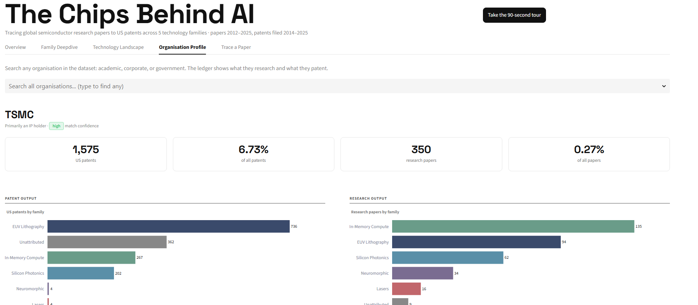
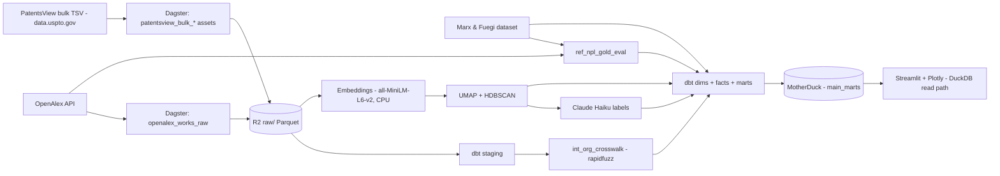

# Paper → Patent: The Chips Behind AI

<!-- MAINTAINED: links -->
[Architecture](./ARCHITECTURE.md) · [Roadmap](./ROADMAP.md) · [Setup](./SETUP.md) · [Data manifest](./docs/data_source_manifest.md) · [Findings](./docs/findings.md) · [dbt docs ↗](https://rm3006.github.io/paper-to-patent/)
<!-- /MAINTAINED -->

**Live app:** https://paper-to-patent-a7iiegantbeucyxxwegpyz.streamlit.app/



Tracing science-adjacent microchip hardware — EUV lithography, silicon photonics, neuromorphic & in-memory compute — from research paper to US patent.

We ingest global scientific output (OpenAlex) and US patents (PatentsView bulk data), resolve the organisations behind both into one identity, link papers to the patents that cite them via non-patent-literature (NPL) citations, cluster everything into named technology families, and surface three things:

- The **citation lag** between a paper's publication and the filing of the patent citing it
- **Who is capturing the IP** (assignee competitive intelligence)
- **How concentrated US patenting is** relative to the breadth of global research

A curious teenager should grasp the map in 90 seconds. An R&D strategist or VC analyst should respect the linkage methodology.

> **Scope**: US patents only (PatentsView) — the USPTO received roughly 1 in 6 (≈16%) of the world's 3.7M patent applications in 2024, and China's CNIPA alone received nearly half (WIPO, *World Intellectual Property Indicators 2025*; see `docs/data_source_manifest.md` §4a); treat "who captures the IP" and concentration claims here as a US-filing view, not a global one. English-language papers only (OpenAlex). Citation lag is publication → filing date — it is not R&D-to-market time and does not imply causation.

---

## How it works



OpenAlex (global research) and PatentsView (US patents) are ingested independently into Parquet on Cloudflare R2. `dbt build --target prod` reads that raw Parquet via `httpfs` and builds staging → intermediate → marts directly into **MotherDuck**, the served warehouse — including a `rapidfuzz`-built organisation crosswalk that gives OpenAlex institutions and PatentsView assignees one shared `org_id`. Non-patent-literature citations link papers to the patents that cite them, sourced from the Marx & Fuegi gold dataset where it has coverage and our own DOI/fuzzy-title matcher where it doesn't. A separate ML branch embeds every paper abstract and patent title (`all-MiniLM-L6-v2`, CPU-only), projects and clusters them (UMAP + HDBSCAN) into named technology families, and has Claude Haiku write each cluster's plain-English name and summary — grounded only in that cluster's own top terms, never invented. The Streamlit app queries MotherDuck directly with in-process DuckDB; there is no export step between what dbt last built and what the app serves.

Full layer-by-layer rationale — what was used, what was considered, and why — lives in [`ARCHITECTURE.md`](ARCHITECTURE.md).

---

## Status

<!-- MAINTAINED: status -->
| Part | Description | Status |
|---|---|---|
| 0 | Pre-flight + NPL feasibility spike | ✅ Done |
| 1 | Foundation + OpenAlex ingest | ✅ Done |
| 2 | PatentsView bulk ingest | ✅ Done |
| 3 | Entity resolution + organisation crosswalk | ✅ Done |
| 4 | dbt modeling + NPL linkage + gold eval | ✅ Done |
| 5 | Embeddings, clustering, and interpretable labels | ✅ Done |
| 6 | Citation-lag & competitive-intelligence analytics | ✅ Done |
| 7 | Streamlit app + polish | ✅ Done |
| 8 | Documentation, deploy, portfolio integration | ⬜ Pending |
<!-- /MAINTAINED -->

---

## Scale & honesty

- **This is a ~1–2 GB corpus, not a big-data problem.** The served marts are single-digit MB. The Cloudflare R2 + Parquet + DuckDB/MotherDuck stack, the Terraform-provisioned bucket, and the Dagster orchestration are here to demonstrate the *pattern* a much larger project would need — not because this dataset requires it. See `ARCHITECTURE.md`'s design constraints.
- **The patent lens is US-only.** PatentsView is USPTO filings only — roughly 1 in 6 of the world's patent applications in 2024, with China's CNIPA alone filing nearly half. ASML, TSMC, Samsung, and Tokyo Electron — companies this project's own scope names — file most of their patents at the EPO, KIPO, and JPO respectively, offices this project cannot see. "Who captures the IP" here means "who captures *US* IP." See `docs/data_source_manifest.md` §4a.
- **Citation lag is not R&D-to-market time.** It is the interval between a paper's publication date and the filing date of a US patent that cites it as non-patent literature. It is never described as "lead time" — an NPL citation can reference prior art being distinguished, not built upon, and the metric carries no causal claim.
- **NPL linkage quality is measured and disclosed, not assumed.** Paper↔patent links come from a hybrid source: the Marx & Fuegi "Reliance on Science" gold dataset supplies edges for any patent it covers (roughly 71% of scope patents; its vintage caps out around early-2023 grants), and our own DOI + fuzzy-title matcher fills only the remainder. The matcher's own precision (0.847, conditional on the gold-coverable subset) is measured against Marx & Fuegi as an eval set, not asserted. See `ARCHITECTURE.md` §7.
- **Entity resolution favours precision over recall.** The `rapidfuzz` bridge across OpenAlex institutions and PatentsView assignees accepts only an exact/subset name match (`token_set_ratio = 100`) — looser thresholds were tested and produced real false positives (e.g. two different universities scoring 89.8). A false merge would silently corrupt every downstream competitive-intelligence number; an unmatched pair stays unmatched and labelled rather than guessed.
- **This is a point-in-time build, not a live feed.** Each `dbt build --target prod` overwrites the served marts; there's no versioned history of past snapshots. An incremental/scheduled refresh is a deliberate v2 scope cut, not an oversight — see `ROADMAP.md` → *Out of scope for v1*.

---

## Tech stack

| Layer | Tool |
|---|---|
| Language | Python 3.11+, SQL (dbt), HCL (Terraform) |
| Dev & quality | uv, ruff, pyright (strict), pytest, GitHub Actions |
| IaC | Terraform (+ Cloudflare provider) |
| Orchestration | Dagster OSS (+ dagster-dbt) |
| Ingestion | PatentsView bulk TSV (data.uspto.gov), OpenAlex HTTP client, polars |
| Data lake | Cloudflare R2, Parquet |
| Warehouse + transform | DuckDB, dbt-core + dbt-duckdb, served via MotherDuck |
| Entity resolution | rapidfuzz |
| ML / NLP | sentence-transformers (`all-MiniLM-L6-v2`), umap-learn, hdbscan, scikit-learn, langdetect |
| LLM | Anthropic Claude Haiku (cluster labels) |
| Serving | Streamlit (Community Cloud), Plotly (`scattergl`), streamlit-searchbox |

See [`ARCHITECTURE.md`](ARCHITECTURE.md) for design rationale (used / considered / why, layer by layer) and [`ROADMAP.md`](ROADMAP.md) for the build plan.

---

## Repo layout

```
pipelines/     Dagster project; package `nexus/`
models/        dbt project (sources → staging → intermediate → marts)
apps/ui/       Streamlit app (Community Cloud)
infra/         Terraform (Cloudflare R2)
docs/          Data source manifest, eval sets, cluster label review
notebooks/     Exploratory; never imported by pipelines
```

---

## Running locally

```bash
cp .env.example .env.local   # fill in credentials
uv sync
uv run --env-file .env.local dagster asset materialize -m nexus --select openalex_works_raw
uv run pytest
uv run ruff check pipelines/nexus/ apps/ui/
uv run pyright pipelines/nexus/ apps/ui/
```

See [`SETUP.md`](SETUP.md) for the full credential checklist.

---

## Where this goes next

The two highest-value extensions, ranked by value-per-effort in `ROADMAP.md` → *Beyond v1*:

1. **Person-level talent flow** — match paper authors to patent inventors to show researchers moving from academia into corporate IP. High effort (name disambiguation is its own hard project), high payoff.
2. **Global patent coverage** — Google Patents Public Data or PATSTAT + OECD HAN would convert the US-only caveat into "global research vs. global commercialisation," directly strengthening the concentration story. Sized and assessed feasible; deliberately not started, since it pulls in a BigQuery/GCP credential that's a real deviation from this project's stated stack.

Smaller, cheaper follow-ons: in-warehouse semantic "find related work" (cosine over existing embeddings, no new infra), a citation-network explorer tab, and an incremental/scheduled refresh to turn this one-shot build into a living atlas. Full scoping, effort estimates, and the reasoning behind what's deliberately *not* being built next live in `ROADMAP.md`.

---

## License

Data sources: OpenAlex (CC-BY 4.0), PatentsView (CC-BY 4.0), Marx & Fuegi dataset (CC-BY 4.0).
Code: MIT.
