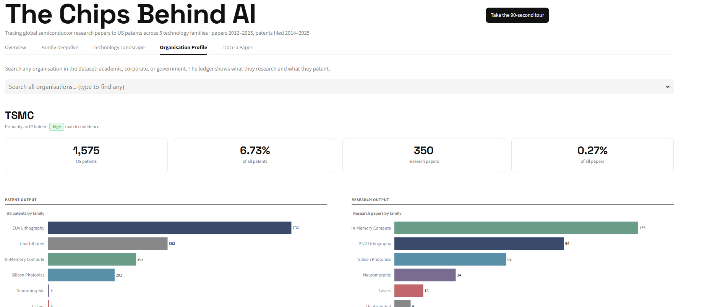
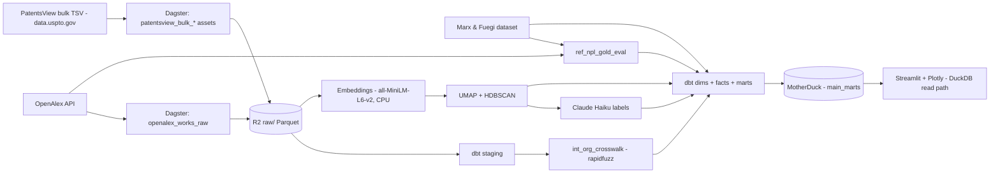

# Paper → Patent: The Chips Behind AI

> Tracing science-adjacent microchip hardware — EUV lithography, silicon photonics, neuromorphic & in-memory compute — from research paper to US patent.

<!-- MAINTAINED: links -->
[Architecture](./ARCHITECTURE.md) · [Roadmap](./ROADMAP.md) · [Setup](./SETUP.md) · [dbt docs](https://rm3006.github.io/paper-to-patent/) · **Status**: Part 8 complete — v1 shipped
<!-- /MAINTAINED -->

<!-- MAINTAINED: hero -->
> **[Open the live app →](https://paper-to-patent-a7iiegantbeucyxxwegpyz.streamlit.app/)**
> Explore the technology map, follow a paper through to the US patents that cite it, and see who's actually capturing the IP.
<!-- /MAINTAINED -->



We pull in global research output from OpenAlex and US patents from PatentsView's bulk data, resolve the organisations on both sides down to one identity, and link papers to the patents that cite them through non-patent-literature (NPL) citations. Everything gets clustered into named technology families. From there we look at three things:

- The **citation lag** between a paper's publication and the filing of the patent that cites it
- **Who's capturing the IP** (assignee-level competitive intelligence)
- **How concentrated** US patenting is, relative to how broad the underlying global research actually is

A curious teenager should be able to grasp the map in about 90 seconds. An R&D strategist or VC analyst should still find the linkage methodology and the entity resolution solid enough to trust.

> **Scope**: US patents only (PatentsView) — the USPTO took in roughly 1 in 6 (≈16%) of the world's 3.7M patent applications in 2024, and China's CNIPA alone accounted for almost half (WIPO, *World Intellectual Property Indicators 2025*; see `docs/data_source_manifest.md` §4a), so treat "who captures the IP" and any concentration claim here as a US-filing view, not a global one. Papers are English-language only (OpenAlex). Citation lag runs from publication to filing date — it's not R&D-to-market time, and it doesn't imply causation.

---

## How it works


```mermaid
flowchart LR
  OA[OpenAlex API] --> OAi[Dagster: openalex_works_raw]
  PV[PatentsView bulk TSV - data.uspto.gov] --> PVi[Dagster: patentsview_bulk_* assets]
  MF[Marx & Fuegi dataset] --> EVAL[ref_npl_gold_eval]
  MF --> MART
  OA --> EVAL
  OAi --> RAW[(R2 raw/ Parquet)]
  PVi --> RAW
  RAW --> STG[dbt staging]
  STG --> ER[int_org_crosswalk - rapidfuzz]
  ER --> MART[dbt dims + facts + marts]
  RAW --> EMB[Embeddings - all-MiniLM-L6-v2, CPU]
  EMB --> CLU[UMAP + HDBSCAN]
  CLU --> LAB[Claude Haiku labels]
  CLU --> MART
  LAB --> MART
  EVAL --> MART
  MART --> MD[(MotherDuck - main_marts)]
  MD --> APP[Streamlit + Plotly - DuckDB read path]
```

OpenAlex (global research) and PatentsView (US patents) get ingested independently into Parquet on Cloudflare R2. From there, `dbt build --target prod` reads that raw Parquet via `httpfs` and builds staging → intermediate → marts straight into **MotherDuck**, the served warehouse — including a `rapidfuzz`-built organisation crosswalk that gives OpenAlex institutions and PatentsView assignees one shared `org_id`. Non-patent-literature citations are what link papers to the patents citing them: we pull those from the Marx & Fuegi gold dataset wherever it has coverage, and fall back to our own DOI/fuzzy-title matcher where it doesn't. A separate ML branch embeds every paper abstract and patent title (`all-MiniLM-L6-v2`, CPU-only), projects and clusters them with UMAP + HDBSCAN into named technology families, then has Claude Haiku write each cluster's plain-English name and summary — grounded only in that cluster's own top terms, nothing invented. The Streamlit app queries MotherDuck directly through in-process DuckDB, so there's no export step between what dbt last built and what the app actually serves.

The full layer-by-layer reasoning — what we used, what we considered instead, and why — lives in [`ARCHITECTURE.md`](ARCHITECTURE.md).

---

## Status

<!-- MAINTAINED: status -->
| Part | Description | Status |
|---|---|---|
| 0 | Pre-flight + NPL feasibility spike | ✅ Done |
| 1 | Foundation + OpenAlex ingest | ✅ Done |
| 2 | PatentsView bulk ingest | ✅ Done |
| 3 | Entity resolution + organisation crosswalk | ✅ Done |
| 4 | dbt modeling + NPL linkage + gold eval | ✅ Done |
| 5 | Embeddings, clustering, and interpretable labels | ✅ Done |
| 6 | Citation-lag & competitive-intelligence analytics | ✅ Done |
| 7 | Streamlit app + polish | ✅ Done |
| 8 | Documentation, deploy, portfolio integration | ✅ Done |
<!-- /MAINTAINED -->

---

## Scale & honesty

- **This is a ~1–2 GB corpus, not a big-data problem** — the served marts are single-digit MB. The Cloudflare R2 + Parquet + DuckDB/MotherDuck stack, the Terraform-provisioned bucket, and the Dagster orchestration are here to show the *pattern* a much bigger project would actually need, not because this dataset demands it. See `ARCHITECTURE.md`'s design constraints section.
- **The patent lens is US-only.** PatentsView only covers USPTO filings — roughly 1 in 6 of the world's patent applications in 2024, while China's CNIPA alone filed nearly half. ASML, TSMC, Samsung, and Tokyo Electron — companies this project's own scope names directly — file most of their patents at the EPO, KIPO, and JPO respectively, none of which we can see here. So "who captures the IP" really means "who captures *US* IP." See `docs/data_source_manifest.md` §4a.
- **Citation lag isn't R&D-to-market time.** It's the interval between a paper's publication date and the filing date of a US patent that cites it as non-patent literature, nothing more. We never call it "lead time" — an NPL citation can just as easily be prior art an examiner is distinguishing from as prior art the invention builds on, so the metric carries no causal claim.
- **NPL linkage quality is measured, not assumed.** Paper↔patent links come from a hybrid source: the Marx & Fuegi "Reliance on Science" gold dataset supplies edges for any patent it covers (roughly 71% of scope patents, though its vintage caps out around early-2023 grants), and our own DOI + fuzzy-title matcher fills in the rest. We don't just claim the matcher works — its precision (0.847, on the gold-coverable subset) is measured against Marx & Fuegi as an eval set. See `ARCHITECTURE.md` §7.
- **Entity resolution favours precision over recall.** The `rapidfuzz` bridge between OpenAlex institutions and PatentsView assignees only accepts an exact/subset name match (`token_set_ratio = 100`) — we tried looser thresholds and they produced real false positives, like two different universities scoring 89.8. A false merge would silently corrupt every downstream competitive-intelligence number, so an unmatched pair just stays unmatched and labelled instead of being guessed at.
- **This is a point-in-time build, not a live feed.** Each `dbt build --target prod` overwrites the served marts, so there's no versioned history of past snapshots. Skipping an incremental/scheduled refresh was a deliberate v2 scope cut, not an oversight — see `ROADMAP.md` → *Out of scope for v1*.

---

## Tech stack

| Layer | Tool |
|---|---|
| Language | Python 3.11+, SQL (dbt), HCL (Terraform) |
| Dev & quality | uv, ruff, pyright (strict), pytest, GitHub Actions |
| IaC | Terraform (+ Cloudflare provider) |
| Orchestration | Dagster OSS (+ dagster-dbt) |
| Ingestion | PatentsView bulk TSV (data.uspto.gov), OpenAlex HTTP client, polars |
| Data lake | Cloudflare R2, Parquet |
| Warehouse + transform | DuckDB, dbt-core + dbt-duckdb, served via MotherDuck |
| Entity resolution | rapidfuzz |
| ML / NLP | sentence-transformers (`all-MiniLM-L6-v2`), umap-learn, hdbscan, scikit-learn, langdetect |
| LLM | Anthropic Claude Haiku (cluster labels) |
| Serving | Streamlit (Community Cloud), Plotly (`scattergl`), streamlit-searchbox |

See [`ARCHITECTURE.md`](ARCHITECTURE.md) for the design rationale, layer by layer, and [`ROADMAP.md`](ROADMAP.md) for the build plan.

---

## Repo layout

```
pipelines/     Dagster project; package `nexus/`
models/        dbt project (sources → staging → intermediate → marts)
apps/ui/       Streamlit app (Community Cloud)
infra/         Terraform (Cloudflare R2)
docs/          Data source manifest, eval sets, cluster label review
notebooks/     Exploratory; never imported by pipelines
```

---

## Running locally

```bash
cp .env.example .env.local   # fill in credentials
uv sync
uv run --env-file .env.local dagster asset materialize -m nexus --select openalex_works_raw
uv run pytest
uv run ruff check pipelines/nexus/ apps/ui/
uv run pyright pipelines/nexus/ apps/ui/
```

See [`SETUP.md`](SETUP.md) for the full credential checklist.

---

## Where this goes next

The two extensions with the best value-per-effort, per `ROADMAP.md` → *Beyond v1*:

1. **Person-level talent flow** — matching paper authors to patent inventors, to show researchers moving from academia into corporate IP. High effort (name disambiguation is a hard project in its own right), but high payoff.
2. **Global patent coverage** — Google Patents Public Data or PATSTAT + OECD HAN would turn the US-only caveat into "global research vs. global commercialisation," which would strengthen the concentration story considerably. It's sized and feasible, but not started — it would pull in a BigQuery/GCP credential, which is a real deviation from this project's stated stack.

Cheaper follow-ons worth doing: an in-warehouse semantic "find related work" feature (cosine over the embeddings we already have, no new infra needed), a citation-network explorer tab, and an incremental/scheduled refresh so this one-shot build becomes a living atlas instead of a snapshot. Full scoping, effort estimates, and the reasoning behind what we're deliberately not building next all live in `ROADMAP.md`.

---

## License

Data sources: OpenAlex (CC-BY 4.0), PatentsView (CC-BY 4.0), Marx & Fuegi dataset (CC-BY 4.0).
Code: MIT.
